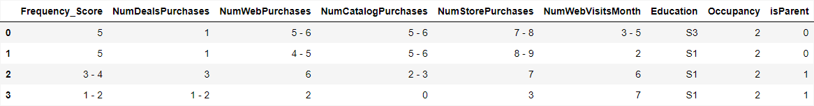
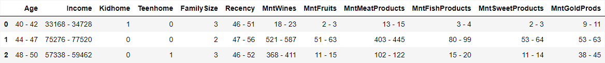
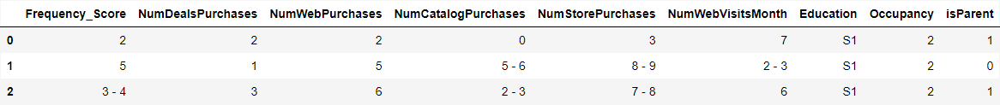
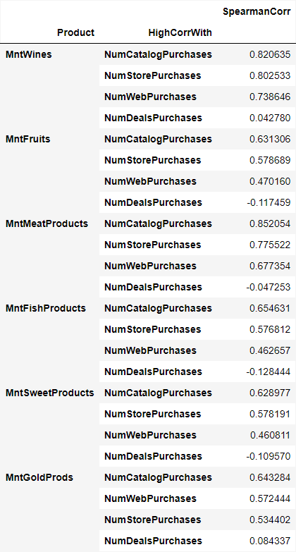

# Customer Segmentation - KMeans, KProtoypes

Photo by [BOXEDWATER](https://unsplash.com/@boxedwater) on [Unsplash](https://unsplash.com/photos/7H1hDt694s8)

## 01: Introduction

**The project's primary goal** is to utilize the K-Means and K-Prototypes algorithms for the purpose of customer segmentation, accompanied by a comprehensive exploratory data analysis of the given dataset.

**Customer segmentation** involves categorizing a company's customers into groups based on similar traits. This strategy helps businesses improve their marketing and product strategies for different customer groups. By dividing customers into specific segments, companies can create tailored marketing messages for each group, using the right communication channels like email, social media, or radio, depending on what each group prefers.

Segmentation also helps companies find opportunities to make better products, improve customer relationships, and test different prices. By focusing on their most profitable customers, providing better customer service, and using upselling and cross-selling strategies, segmentation becomes a powerful tool for optimizing marketing efforts and growing the business.

**The algorithm used** to create the customer segmentation are: 

1. KMeans: A more conventional clustering method involves employing K-Means clustering. This is an unsupervised machine learning algorithm that relies on Euclidean or Manhattan distance metrics. K-Means is well-suited for numerical data exclusively, but there is a common practice of converting categorical data into numerical form through encoding and then applying Principal Component Analysis (PCA) to the encoded data. The acceptability of this approach remains a subject of debate within the field.

2. KPrototypes *(the python package for this algorithm can be found on this [GitHub Link](https://github.com/nicodv/kmodes)):* 
A more recent method in clustering is to use KPrototypes from [Huang's Research](https://github.com/nicodv/kmodes#huang97). The K-Prototypes algorithm is an algorithm that blends K-Modes and K-Means, allowing it to group data that contains a mix of numbers and categories. 

**The dataset for this project** can be downloaded through the following [Kaggle Link](https://www.kaggle.com/datasets/imakash3011/customer-personality-analysis). Based on the information provided on Kaggle, this dataset was provided by Dr. Omar Romero-Hernandez. The dataset descriptions can be checked through that [Kaggle Link](https://www.kaggle.com/datasets/imakash3011/customer-personality-analysis) or opening up the project file.

**Project File:** "CustSegment.ipynb"

## 02: Some Findings

1. Profiles from KMeans Clustering

   

   

   *Note1: The index represents cluster profiles, while the columns represent features.*

   *Note2: The table above presents the segmented customer profile, illustrating the inclinations of each profiled customer in various features. Tendencies for numerical values are determined using the median confidence interval due to the non-normal distribution of the data, while categorical features are assessed based on the mode. It is also important to remember that to classify future customers, it is best to use the labels from KMeans clustering.*

   

2. Profiles from KPrototypes Clustering

   

   

   *Note1: The index represents cluster profiles, while the columns represent features.*

   *Note2: This table summarizes the customer segmentation profiles using KPrototypes algorithm. The numerical features use median confidence interval while the categorical features use mode. To classify future customers, please use labels from K-Prototypes Clustering.*

   

3. The correlation rankings between products and products

   

   

4. The correlation rankings between products and places (marketing channels)

   

   

## 03: Project Table of Content

01 Introduction

02 Exploratory Data Analysis Pre-Clustering

- 02.01 Importing Libraries
- 02.02 Importing Data
- 02.03 Data Understanding
- 02.04 Feature Engineering
- 02.05 Checking the Descriptive Statistics
- 02.06 Creating RF (Recency Frequency) Analysis
- 02.07 Analyzing the Relationship Between Number of Children, Number of Occupancy, and Total Spending

03 KMeans Clustering

- 03.01 Preprocessing
- 03.02 Clustering with KMeans
- 03.03 Analyzing the KMeans Clusters
- 03.04 Profiling the KMeans Clusters

04 KPrototypes Clustering

- 04.01 Preprocessing
- 04.02 Clustering with KPrototypes
- 04.03 Analyzing the KPrototypes Clusters
- 04.04 Profiling the KPrototypes Clusters

## 04: Profile

© Benedict Laiman 2023

Get in touch with me through:

- [Linkedin](https://www.linkedin.com/in/benedict-laiman-60401319a/)
- [Discord](https://discordapp.com/users/525654231940857867/)

